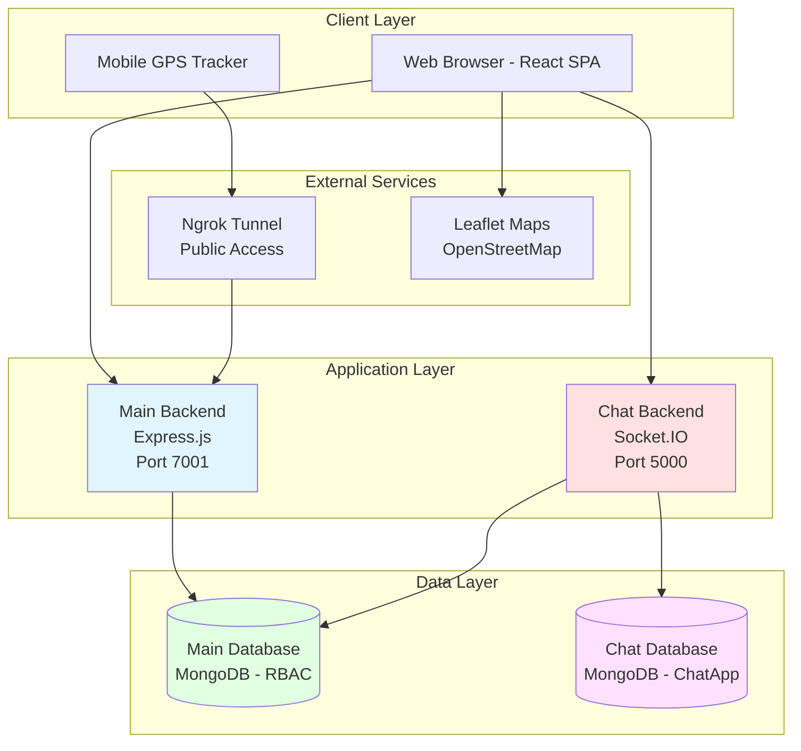
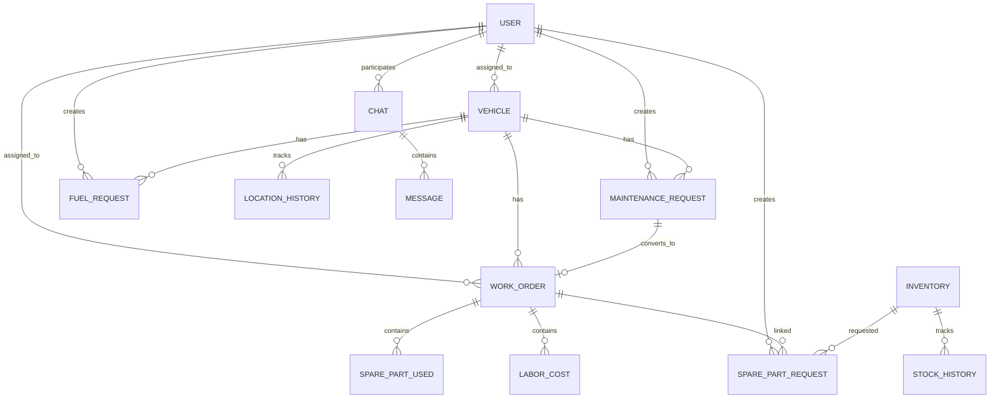
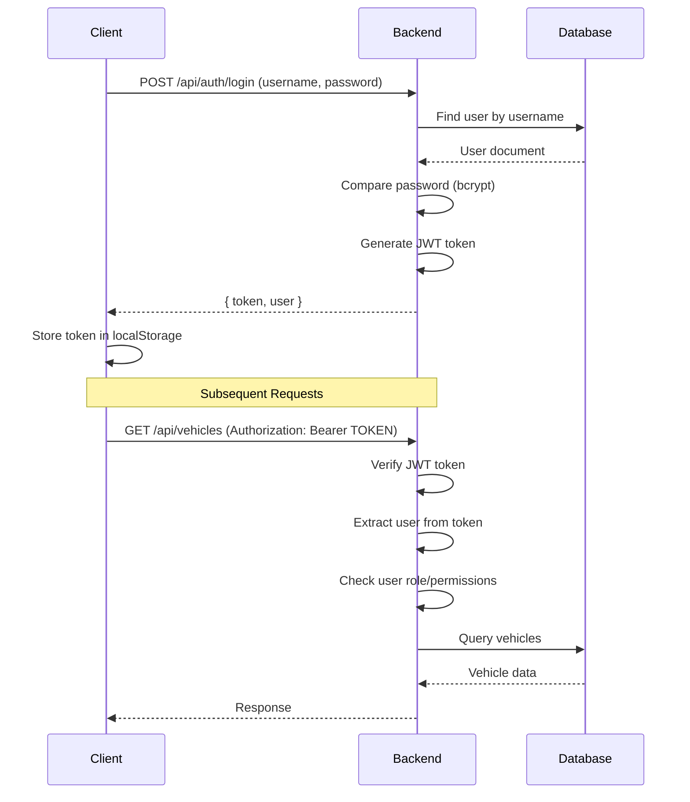

# Fleet Resource Management System - Complete Documentation

> **Version**: 1.0.0  
> **Last Updated**: February 2026  
> **Purpose**: Comprehensive technical documentation for the entire Fleet Resource Management System

---

## Table of Contents

1. [System Overview](#system-overview)
2. [Architecture](#architecture)
3. [Technology Stack](#technology-stack)
4. [Core Modules](#core-modules)
5. [Database Design](#database-design)
6. [Authentication & Authorization](#authentication--authorization)
7. [API Documentation](#api-documentation)
8. [Frontend Architecture](#frontend-architecture)
9. [Real-Time Features](#real-time-features)
10. [Deployment Guide](#deployment-guide)
11. [Security](#security)
12. [Troubleshooting](#troubleshooting)

---

## System Overview

### What is Fleet Resource Management System?

The Fleet Resource Management System is a comprehensive web-based platform designed to manage all aspects of vehicle fleet operations, including:

- **Vehicle Management**: Track vehicles, assignments, and status
- **User Management**: Role-based access control (RBAC)
- **Maintenance Tracking**: Request, approve, and track maintenance work
- **Work Orders**: Convert maintenance requests to trackable work orders
- **Inventory Management**: Track spare parts and supplies
- **Fuel Management**: Request and approve fuel allocations
- **Per Diem Management**: Handle employee travel allowances
- **GPS Tracking**: Real-time vehicle location tracking
- **Chat System**: Real-time communication between users
- **Notifications**: System-wide notification system
- **Reporting**: Generate reports and analytics

### Key Features

✅ **Multi-tenant Architecture** with role-based access  
✅ **Real-time GPS Tracking** with route history  
✅ **Real-time Chat** with Socket.IO  
✅ **Image Upload** for maintenance requests  
✅ **Automated Workflows** for approvals  
✅ **Cost Tracking** for maintenance and fuel  
✅ **Service Scheduling** based on odometer readings  
✅ **Stock Management** with low-stock alerts  
✅ **Mobile-Friendly** GPS tracker interface  
✅ **Audit Trails** for all critical operations  

---

## Architecture

### System Architecture



### Microservices Approach

**Main Backend** (`backend/` - Port 7001)
- Handles all business logic
- Vehicle, user, maintenance, inventory management
- GPS tracking and location updates
- File uploads (maintenance images)
- Authentication and authorization

**Chat Backend** (`chat-backend/` - Port 5000)
- Dedicated real-time chat service
- Socket.IO for bidirectional communication
- User synchronization from main DB
- One-on-one and group chats
- Online status tracking

### Database Strategy

**Dual-Database Architecture:**

1. **Main Database (RBAC)**
   - Source of truth for users
   - All business data
   - Vehicles, requests, inventory

2. **Chat Database (ChatApp)**
   - Synced user data
   - Chat messages and conversations
   - Optimized for real-time queries

---

## Technology Stack

### Backend Technologies

| Technology | Version | Purpose |
|------------|---------|---------|
| **Node.js** | 18+ | Runtime environment |
| **Express.js** | 5.1.0 | Web framework |
| **MongoDB** | 8.17.0 | NoSQL database |
| **Mongoose** | 8.17.0 | ODM for MongoDB |
| **Socket.IO** | 4.8.3 | Real-time communication |
| **JWT** | 9.0.2 | Authentication tokens |
| **bcryptjs** | 3.0.2 | Password hashing |
| **Multer** | 2.0.2 | File upload handling |
| **CORS** | 2.8.5 | Cross-origin requests |
| **dotenv** | 17.2.1 | Environment variables |

### Frontend Technologies

| Technology | Version | Purpose |
|------------|---------|---------|
| **React** | 18.2.0 | UI framework |
| **React Router** | 6.3.0 | Client-side routing |
| **Axios** | 1.3.4 | HTTP client |
| **Socket.IO Client** | 4.8.3 | Real-time client |
| **Leaflet** | 1.9.4 | Map visualization |
| **React Leaflet** | 4.2.1 | React wrapper for Leaflet |
| **Recharts** | 2.5.0 | Data visualization |
| **Lucide React** | 0.263.1 | Icon library |
| **React Hot Toast** | 2.4.0 | Toast notifications |
| **date-fns** | 2.29.3 | Date manipulation |
| **XLSX** | 0.18.5 | Excel export |
| **TailwindCSS** | 3.2.7 | Utility-first CSS |

### Development Tools

- **Nodemon**: Auto-restart server on changes
- **Ngrok**: Expose local server to internet (for mobile GPS)
- **Postman**: API testing
- **MongoDB Compass**: Database GUI

---

## Core Modules

### 1. User Management Module

**Purpose**: Manage system users with role-based access control

**Features:**
- User registration and authentication
- Role assignment (admin, manager, user)
- User status management (active, inactive, suspended)
- Profile management
- Password reset

**Roles & Permissions:**

| Role | Permissions |
|------|-------------|
| **Admin** | Full system access, user management, all CRUD operations |
| **Manager** | Approve requests, manage vehicles, view reports |
| **User** | Create requests, view assigned vehicles, basic operations |

**Key Files:**
- Model: `backend/src/models/userModel.js`
- Controller: `backend/src/controllers/userController.js`
- Routes: `backend/src/routes/userRoutes.js`

### 2. Vehicle Management Module

**Purpose**: Track and manage fleet vehicles

**Features:**
- Vehicle registration with details
- Driver assignment (one driver per vehicle)
- Status tracking (active, under_maintenance, inactive)
- Odometer tracking
- Service scheduling based on mileage
- GPS location tracking
- Maintenance history
- Service history

**Vehicle Lifecycle:**
```
Registration → Active → [Maintenance Request] → Under Maintenance → 
[Work Order] → [Completion] → Active
```

**Key Fields:**
- `plateNumber`: Unique identifier
- `type`: Automobile, Light Duty, Heavy Duty, Machinery
- `currentKm`: Current odometer reading
- `serviceIntervalKm`: Service every X km (default: 5000)
- `previousServiceKm`: Last service odometer
- `assignedDriver`: One driver per vehicle
- `location`: Current GPS coordinates

**Key Files:**
- Model: `backend/src/models/vehicleModel.js`
- Controller: `backend/src/controllers/vehicleController.js`
- Routes: `backend/src/routes/vehicleRoutes.js`

### 3. Maintenance Request Module

**Purpose**: Handle vehicle maintenance reporting and approval

**Features:**
- Create maintenance requests with photos (up to 5)
- Categorize issues (Engine, Brakes, Service, etc.)
- Priority levels (low, medium, high)
- Approval workflow
- Cost tracking
- Service km recording

**Workflow:**
```
Driver Reports Issue → Upload Photos → Request Created → 
Manager Reviews → Approves/Rejects → 
[If Approved] → Convert to Work Order
```

**Status Flow:**
- `pending` → `approved` / `rejected` / `completed`
- `approved` → `completed` / `rejected`
- `rejected` / `completed` → Final states

**Key Files:**
- Model: `backend/src/models/maintenanceRequest.js`
- Controller: `backend/src/controllers/maintenanceController.js`
- Routes: `backend/src/routes/maintenanceRoutes.js`
- Upload Middleware: `backend/src/middlewares/upload.js`

### 4. Work Order Module

**Purpose**: Track maintenance work execution

**Features:**
- Convert approved maintenance requests
- Auto-generate work order numbers (WO-YYYY-NNNN)
- Assign mechanics
- Track spare parts usage
- Record labor hours and costs
- Progress notes
- Complete audit trail
- Auto-calculate total costs

**Workflow:**
```
Maintenance Approved → Create Work Order → Assign Mechanics → 
Request Parts → Add Labor → Complete → Update Vehicle Status
```

**Cost Calculation:**
```
Total Cost = Total Parts Cost + Total Labor Cost
Total Parts Cost = Σ (approved parts only)
Total Labor Cost = Σ (hours × hourly rate)
```

**Key Files:**
- Model: `backend/src/models/workOrderModel.js`
- Controller: `backend/src/controllers/workOrderController.js`
- Routes: `backend/src/routes/workOrderRoutes.js`

### 5. Inventory Management Module

**Purpose**: Track spare parts and supplies

**Features:**
- Item management with unique codes
- Stock tracking (current, minimum, maximum)
- Low stock alerts
- Stock history with audit trail
- Categories (Spare Parts, Lubricants, Tires, etc.)
- Virtual fields (stockStatus, stockValue)
- Supplier tracking

**Stock Operations:**
- `addition`: Add new stock
- `usage`: Remove stock (used in repair)
- `adjustment`: Correct stock levels
- `damage`: Remove damaged stock
- `return`: Add returned stock

**Auto-Status Updates:**
- `currentStock === 0` → `out_of_stock`
- `currentStock <= minimumStock` → `low_stock`
- `currentStock >= maximumStock` → `overstocked`
- Otherwise → `adequate`

**Key Files:**
- Model: `backend/src/models/inventoryModel.js`
- Controller: `backend/src/controllers/inventoryController.js`
- Routes: `backend/src/routes/inventoryRoutes.js`

### 6. Spare Part Request Module

**Purpose**: Request and approve spare parts usage

**Features:**
- Create requests for inventory items
- Link to work orders
- Approval workflow
- Auto-deduct stock on approval
- Update work order costs

**Workflow:**
```
Mechanic Requests Part → Admin Reviews → 
[If Approved] → Deduct Stock → Update Work Order Cost
[If Rejected] → Mark Part as Rejected → Zero Cost
```

**Key Files:**
- Model: `backend/src/models/sparePartRequest.js`
- Controller: `backend/src/controllers/sparePartRequestController.js`
- Routes: `backend/src/routes/sparePartRequestRoutes.js`

### 7. Fuel Request Module

**Purpose**: Manage fuel allocation requests

**Features:**
- Request fuel for vehicles
- Specify quantity and purpose
- Auto-calculate cost (quantity × pricePerLitre)
- Approval workflow
- Track odometer at fuel request

**Key Fields:**
- `vehicleId`: Which vehicle
- `quantity`: Liters requested
- `pricePerLitre`: Cost per liter
- `currentKm`: Odometer reading
- `cost`: Auto-calculated

**Key Files:**
- Model: `backend/src/models/fuelRequest.js`
- Controller: `backend/src/controllers/fuelController.js`
- Routes: `backend/src/routes/fuelRoutes.js`

### 8. Per Diem Request Module

**Purpose**: Handle employee travel allowances

**Features:**
- Request per diem for trips
- Specify destination and duration
- Daily rate calculation
- Approval workflow

**Key Files:**
- Model: `backend/src/models/perDiemRequest.js`
- Controller: `backend/src/controllers/perDiemController.js`
- Routes: `backend/src/routes/perDiemRoutes.js`

### 9. GPS Tracking Module

**Purpose**: Real-time vehicle location tracking

**Features:**
- Mobile GPS tracker interface
- Real-time location updates
- Route history storage
- Map visualization with Leaflet
- Auto-cleanup old locations (30 days)
- Path replay functionality

**Location Update Flow:**
```
Mobile Tracker → POST /api/gps/update → 
Save to Vehicle.location → 
Save to Vehicle.locationHistory → 
Frontend Polls → Display on Map
```

**Key Files:**
- Routes: `backend/src/routes/gpsRoutes.js`
- Mobile Tracker: `backend/public/mobile-tracker.html`
- Frontend Map: `frontend/src/pages/VehicleTracking.js`

### 10. Chat System Module

**Purpose**: Real-time communication between users

**Features:**
- One-on-one chats
- Group chats
- Online/offline status
- Typing indicators
- Read receipts
- Unread message counts
- User search with auto-sync

**Architecture:**
- Separate backend (Port 5000)
- Socket.IO for real-time
- Dual-database with user sync
- JWT authentication

**Key Files:**
- Backend: `chat-backend/src/server.js`
- Models: `chat-backend/src/models/`
- Frontend Context: `frontend/src/contexts/ChatContext.js`
- Frontend Page: `frontend/src/pages/Chat.js`

### 11. Notification System

**Purpose**: System-wide notifications

**Features:**
- Real-time notifications
- Notification types (maintenance, fuel, chat, etc.)
- Read/unread status
- Action URLs
- Metadata for context

**Notification Triggers:**
- Maintenance request created/approved/completed
- Work order assigned/completed
- Spare part request approved/rejected
- Fuel request approved/rejected
- Chat messages

**Key Files:**
- Model: `backend/src/models/notification.js`
- Routes: `backend/src/routes/notificationRoutes.js`

### 12. News/Announcements Module

**Purpose**: System-wide announcements

**Features:**
- Create news posts
- Categorize announcements
- Publish/unpublish
- Display on dashboard

**Key Files:**
- Model: `backend/src/models/newsModel.js`
- Routes: `backend/src/routes/newsRoutes.js`

### 13. Activity Logs Module

**Purpose**: Audit trail for system actions

**Features:**
- Log all critical operations
- Track user actions
- Timestamp all events
- Searchable logs

**Key Files:**
- Model: `backend/src/models/logModel.js`
- Routes: `backend/src/routes/logRoutes.js`

---

## Database Design

### Main Database (RBAC)

**Collections:**

1. **users**
   - User accounts and profiles
   - Roles and permissions
   - Authentication credentials

2. **vehicles**
   - Vehicle information
   - Current location
   - Location history (30 days)
   - Service history
   - Maintenance history

3. **maintenancerequests**
   - Maintenance reports
   - Image attachments
   - Approval status

4. **workorders**
   - Work order details
   - Spare parts used
   - Labor costs
   - Progress notes
   - History trail

5. **inventories**
   - Spare parts catalog
   - Stock levels
   - Stock history

6. **sparepartrequests**
   - Part requests
   - Approval status
   - Work order links

7. **fuelrequests**
   - Fuel allocation requests
   - Cost calculations

8. **perdiemrequests**
   - Travel allowance requests

9. **notifications**
   - User notifications
   - Read status

10. **news**
    - System announcements

11. **logs**
    - Activity audit trail

### Chat Database (ChatApp)

**Collections:**

1. **users**
   - Synced from main DB
   - Chat-specific fields

2. **chats**
   - Chat conversations
   - Participants
   - Latest message

3. **messages**
   - Chat messages
   - Read receipts

### Entity Relationship Diagram



---

## Authentication & Authorization

### Authentication Flow



### JWT Token Structure

```javascript
{
  "id": "user_id",
  "username": "john_doe",
  "role": "manager",
  "iat": 1706956800,  // Issued at
  "exp": 1707043200   // Expires (24 hours)
}
```

### Middleware: verifyToken

**File**: `backend/src/middlewares/authMiddleware.js`

```javascript
const verifyToken = (req, res, next) => {
    const token = req.headers.authorization?.split(' ')[1];
    
    if (!token) {
        return res.status(401).json({ message: 'No token provided' });
    }
    
    try {
        const decoded = jwt.verify(token, process.env.JWT_SECRET);
        req.user = decoded; // Attach user to request
        next();
    } catch (error) {
        return res.status(401).json({ message: 'Invalid token' });
    }
};
```

### Role-Based Access Control

**Middleware**: `requireRole`

```javascript
const requireRole = (...allowedRoles) => {
    return (req, res, next) => {
        if (!req.user) {
            return res.status(401).json({ message: 'Unauthorized' });
        }
        
        if (!allowedRoles.includes(req.user.role)) {
            return res.status(403).json({ message: 'Forbidden' });
        }
        
        next();
    };
};

// Usage
router.post('/vehicles', verifyToken, requireRole('admin', 'manager'), createVehicle);
```

---

## API Documentation

### Base URLs

- **Main Backend**: `http://localhost:7001/api`
- **Chat Backend**: `http://localhost:5000/api`
- **Production**: Use Ngrok tunnel for mobile access

### Authentication Endpoints

| Method | Endpoint | Description | Auth | Body |
|--------|----------|-------------|------|------|
| POST | `/auth/register` | Register new user | Admin | `username, password, fullName, role` |
| POST | `/auth/login` | User login | Public | `username, password` |
| GET | `/auth/me` | Get current user | Token | - |
| PUT | `/auth/change-password` | Change password | Token | `oldPassword, newPassword` |

### User Endpoints

| Method | Endpoint | Description | Auth | Body |
|--------|----------|-------------|------|------|
| GET | `/users` | Get all users | Admin | - |
| GET | `/users/:id` | Get user by ID | Token | - |
| PUT | `/users/:id` | Update user | Admin | `fullName, email, role, status` |
| DELETE | `/users/:id` | Delete user | Admin | - |
| GET | `/users/role/:role` | Get users by role | Token | - |

### Vehicle Endpoints

| Method | Endpoint | Description | Auth | Body |
|--------|----------|-------------|------|------|
| POST | `/vehicles` | Create vehicle | Manager+ | `plateNumber, type, model, fuelType, currentKm` |
| GET | `/vehicles` | Get all vehicles | Token | Query: `status, type, assignedDriver` |
| GET | `/vehicles/:id` | Get vehicle by ID | Token | - |
| PUT | `/vehicles/:id` | Update vehicle | Manager+ | `currentKm, status, assignedDriver` |
| DELETE | `/vehicles/:id` | Delete vehicle | Admin | - |
| PATCH | `/vehicles/:id/assign-driver` | Assign driver | Manager+ | `driverId` |
| GET | `/vehicles/:id/history` | Get vehicle history | Token | - |

### Maintenance Endpoints

| Method | Endpoint | Description | Auth | Body |
|--------|----------|-------------|------|------|
| POST | `/maintenance` | Create request | Driver+ | `vehicleId, category, description, priority, images[]` |
| GET | `/maintenance` | Get all requests | Manager+ | - |
| GET | `/maintenance/:id` | Get by ID | Manager+ | - |
| GET | `/maintenance/my` | Get user's requests | Driver+ | - |
| PUT | `/maintenance/:id` | Update status | Manager+ | `status, remarks, cost` |
| DELETE | `/maintenance/:id` | Delete request | Admin | - |

### Work Order Endpoints

| Method | Endpoint | Description | Auth | Body |
|--------|----------|-------------|------|------|
| POST | `/work-orders/convert/:maintenanceId` | Convert to WO | Manager+ | - |
| GET | `/work-orders` | Get all WOs | Manager+ | Query: `status, vehicleId` |
| GET | `/work-orders/:id` | Get by ID | Token | - |
| PATCH | `/work-orders/:id/assign` | Assign mechanics | Manager+ | `mechanicIds[]` |
| PATCH | `/work-orders/:id/parts` | Add spare parts | Manager+ | `parts[]` |
| PATCH | `/work-orders/:id/labor` | Add labor cost | Manager+ | `mechanicId, hours, hourlyRate` |
| PATCH | `/work-orders/:id/progress` | Update progress | Mechanic+ | `note, status` |
| PATCH | `/work-orders/:id/complete` | Complete WO | Manager+ | `finalNotes` |
| DELETE | `/work-orders/:id` | Delete WO | Admin | - |

### Inventory Endpoints

| Method | Endpoint | Description | Auth | Body |
|--------|----------|-------------|------|------|
| POST | `/inventory` | Create item | Manager+ | `itemName, itemCode, category, currentStock` |
| GET | `/inventory` | Get all items | Token | Query: `category, status, lowStock` |
| GET | `/inventory/:id` | Get by ID | Token | - |
| PUT | `/inventory/:id` | Update item | Manager+ | `itemName, unitPrice, etc` |
| DELETE | `/inventory/:id` | Delete item | Admin | - |
| PATCH | `/inventory/:id/adjust` | Adjust stock | Manager+ | `type, quantity, reason` |
| GET | `/inventory/low-stock` | Get low stock | Manager+ | - |
| GET | `/inventory/:id/history` | Get stock history | Manager+ | - |
| GET | `/inventory/stats` | Get statistics | Manager+ | - |

### GPS Endpoints

| Method | Endpoint | Description | Auth | Body |
|--------|----------|-------------|------|------|
| POST | `/gps/update` | Update location | Token | `vehicleId, latitude, longitude` |
| GET | `/gps/vehicle/:id` | Get vehicle location | Token | - |
| GET | `/gps/vehicle/:id/history` | Get route history | Token | Query: `startDate, endDate` |

### Chat Endpoints (Port 5000)

| Method | Endpoint | Description | Auth | Body |
|--------|----------|-------------|------|------|
| POST | `/chats` | Create/access chat | Token | `userId` |
| GET | `/chats` | Get all chats | Token | - |
| POST | `/chats/group` | Create group chat | Token | `name, users[]` |
| GET | `/messages/:chatId` | Get messages | Token | - |
| POST | `/messages` | Send message | Token | `chatId, content` |
| PUT | `/messages/read/:chatId` | Mark as read | Token | - |
| GET | `/users` | Search users | Token | Query: `search` |

---

## Frontend Architecture

### Project Structure

```
frontend/
├── public/
│   ├── index.html
│   └── favicon.ico
├── src/
│   ├── components/
│   │   ├── Layout.js              # Main layout wrapper
│   │   ├── Sidebar.js             # Navigation sidebar
│   │   ├── Header.js              # Top header
│   │   ├── ProtectedRoute.js      # Auth guard
│   │   └── miscellaneous/
│   │       ├── GroupChatModal.js
│   │       └── ...
│   ├── contexts/
│   │   ├── AuthContext.js         # Auth state management
│   │   └── ChatContext.js         # Chat state management
│   ├── pages/
│   │   ├── Login.js
│   │   ├── Dashboard.js
│   │   ├── Vehicles.js
│   │   ├── Maintenance.js
│   │   ├── WorkOrders.js
│   │   ├── Inventory.js
│   │   ├── VehicleTracking.js     # GPS map
│   │   ├── Chat.js
│   │   └── ...
│   ├── services/
│   │   └── api.js                 # Axios instance
│   ├── utils/
│   │   └── helpers.js
│   ├── App.js                     # Main app component
│   ├── index.js                   # Entry point
│   └── index.css                  # Global styles
└── package.json
```

### State Management

**Auth Context** (`AuthContext.js`):
```javascript
const AuthContext = createContext();

export const AuthProvider = ({ children }) => {
    const [user, setUser] = useState(null);
    const [token, setToken] = useState(localStorage.getItem('token'));
    
    const login = async (username, password) => {
        const response = await api.post('/auth/login', { username, password });
        setToken(response.data.token);
        setUser(response.data.user);
        localStorage.setItem('token', response.data.token);
    };
    
    const logout = () => {
        setToken(null);
        setUser(null);
        localStorage.removeItem('token');
    };
    
    return (
        <AuthContext.Provider value={{ user, token, login, logout }}>
            {children}
        </AuthContext.Provider>
    );
};
```

**Chat Context** (`ChatContext.js`):
```javascript
const ChatContext = createContext();

export const ChatProvider = ({ children }) => {
    const [socket, setSocket] = useState(null);
    const [onlineUsers, setOnlineUsers] = useState([]);
    const [chats, setChats] = useState([]);
    const [selectedChat, setSelectedChat] = useState(null);
    const [messages, setMessages] = useState([]);
    
    // Socket.IO connection
    useEffect(() => {
        if (user) {
            const newSocket = io('http://localhost:5000');
            newSocket.emit('setup', user);
            setSocket(newSocket);
        }
    }, [user]);
    
    // Listen for messages
    useEffect(() => {
        if (socket) {
            socket.on('message_recieved', (newMessage) => {
                setMessages(prev => [...prev, newMessage]);
            });
        }
    }, [socket]);
    
    return (
        <ChatContext.Provider value={{ socket, onlineUsers, chats, messages }}>
            {children}
        </ChatContext.Provider>
    );
};
```

### Routing

**App.js**:
```javascript
function App() {
    return (
        <AuthProvider>
            <ChatProvider>
                <BrowserRouter>
                    <Routes>
                        <Route path="/login" element={<Login />} />
                        
                        <Route element={<ProtectedRoute />}>
                            <Route element={<Layout />}>
                                <Route path="/" element={<Dashboard />} />
                                <Route path="/vehicles" element={<Vehicles />} />
                                <Route path="/maintenance" element={<Maintenance />} />
                                <Route path="/work-orders" element={<WorkOrders />} />
                                <Route path="/inventory" element={<Inventory />} />
                                <Route path="/tracking" element={<VehicleTracking />} />
                                <Route path="/chat" element={<Chat />} />
                                {/* ... more routes */}
                            </Route>
                        </Route>
                    </Routes>
                </BrowserRouter>
            </ChatProvider>
        </AuthProvider>
    );
}
```

### API Service

**services/api.js**:
```javascript
import axios from 'axios';

const api = axios.create({
    baseURL: 'http://localhost:7001/api',
    headers: {
        'Content-Type': 'application/json'
    }
});

// Request interceptor - add token
api.interceptors.request.use(
    (config) => {
        const token = localStorage.getItem('token');
        if (token) {
            config.headers.Authorization = `Bearer ${token}`;
        }
        return config;
    },
    (error) => Promise.reject(error)
);

// Response interceptor - handle errors
api.interceptors.response.use(
    (response) => response,
    (error) => {
        if (error.response?.status === 401) {
            localStorage.removeItem('token');
            window.location.href = '/login';
        }
        return Promise.reject(error);
    }
);

export default api;
```

---

## Real-Time Features

### GPS Tracking

**Mobile Tracker** (`backend/public/mobile-tracker.html`):
- HTML5 Geolocation API
- Auto-updates every 10 seconds
- Sends to `/api/gps/update`
- Displays current coordinates

**Backend Storage**:
```javascript
// Update vehicle location
vehicle.location = {
    type: 'Point',
    coordinates: [longitude, latitude]
};

// Add to history
vehicle.locationHistory.push({
    coordinates: [longitude, latitude],
    timestamp: new Date()
});

await vehicle.save();
```

**Frontend Display**:
- Leaflet map with OpenStreetMap tiles
- Real-time marker updates
- Route history visualization
- Polyline for path display

### Chat System

**Socket.IO Events**:

**Server Events:**
- `setup`: User connects
- `join_chat`: Join specific chat room
- `typing`: User is typing
- `stop_typing`: User stopped typing
- `new_message`: Send new message
- `mark_read`: Mark messages as read
- `disconnect`: User disconnects

**Client Events:**
- `message_recieved`: New message received
- `get_online_users`: Online users list
- `typing`: Someone is typing
- `stop_typing`: Someone stopped typing
- `message_read_status`: Read receipt update

**Example Flow:**
```javascript
// Client sends message
socket.emit('new_message', newMessage);

// Server broadcasts to chat room
socket.in(chatId).emit('message_recieved', newMessage);

// Other clients receive
socket.on('message_recieved', (message) => {
    setMessages(prev => [...prev, message]);
});
```

---

## Deployment Guide

### Environment Variables

**Backend** (`.env`):
```env
PORT=7001
MONGO_URI=mongodb://localhost:27017/RBAC
JWT_SECRET=your_super_secret_key_here
NODE_ENV=development
```

**Chat Backend** (`.env`):
```env
PORT=5000
MONGO_URI=mongodb://localhost:27017/ChatApp
MAIN_DB_URI=mongodb://localhost:27017/RBAC
JWT_SECRET=your_super_secret_key_here
```

**Frontend** (`.env`):
```env
REACT_APP_API_URL=http://localhost:7001/api
REACT_APP_CHAT_URL=http://localhost:5000
```

### Running Locally

**1. Start MongoDB:**
```bash
mongod
```

**2. Start Main Backend:**
```bash
cd backend
npm install
npm run dev
```

**3. Start Chat Backend:**
```bash
cd chat-backend
npm install
npm run dev
```

**4. Start Frontend:**
```bash
cd frontend
npm install
npm start
```

**5. (Optional) Start Ngrok for Mobile GPS:**
```bash
ngrok http 7001
```

### Production Deployment

**Backend:**
1. Set `NODE_ENV=production`
2. Use production MongoDB URI
3. Enable CORS for specific origins only
4. Use HTTPS
5. Set up PM2 for process management
6. Configure reverse proxy (Nginx)

**Frontend:**
1. Build production bundle: `npm run build`
2. Serve static files with Nginx/Apache
3. Update API URLs to production endpoints
4. Enable service worker for PWA

**Database:**
1. Use MongoDB Atlas or managed MongoDB
2. Enable authentication
3. Set up backups
4. Create indexes for performance

---

## Security

### Best Practices Implemented

✅ **Password Hashing**: bcryptjs with salt rounds  
✅ **JWT Authentication**: Secure token-based auth  
✅ **Role-Based Access**: Middleware checks permissions  
✅ **Input Validation**: Mongoose schema validation  
✅ **File Upload Security**: Multer with file type/size limits  
✅ **CORS Configuration**: Restrict origins in production  
✅ **SQL Injection Prevention**: MongoDB/Mongoose (NoSQL)  
✅ **XSS Prevention**: React auto-escapes output  

### Security Recommendations

1. **Use HTTPS** in production
2. **Rotate JWT secrets** regularly
3. **Implement rate limiting** for API endpoints
4. **Add request logging** for audit trails
5. **Sanitize user inputs** before processing
6. **Use environment variables** for secrets
7. **Enable MongoDB authentication**
8. **Implement CSRF protection** for state-changing operations
9. **Add API versioning** for backward compatibility
10. **Monitor for suspicious activity**

---

## Troubleshooting

### Common Issues

#### 1. MongoDB Connection Failed

**Error**: `MongooseServerSelectionError: connect ECONNREFUSED`

**Solution:**
```bash
# Check if MongoDB is running
mongod --version

# Start MongoDB
mongod

# Or use MongoDB service
sudo systemctl start mongod
```

#### 2. JWT Token Invalid

**Error**: `401 Unauthorized - Invalid token`

**Solution:**
- Check if token is expired (24-hour expiry)
- Verify JWT_SECRET matches between backend and token generation
- Clear localStorage and login again

#### 3. CORS Error

**Error**: `Access to XMLHttpRequest blocked by CORS policy`

**Solution:**
```javascript
// In backend server.js
app.use(cors({
    origin: 'http://localhost:3000', // Frontend URL
    credentials: true
}));
```

#### 4. Socket.IO Connection Failed

**Error**: `WebSocket connection failed`

**Solution:**
- Check if chat backend is running on port 5000
- Verify Socket.IO client version matches server
- Check firewall settings

#### 5. Image Upload Fails

**Error**: `MulterError: File too large`

**Solution:**
- Check file size (max 5MB per file)
- Verify file type (JPEG, PNG, GIF, WebP only)
- Ensure `uploads/maintenance` directory exists

#### 6. GPS Location Not Updating

**Solution:**
- Check if HTTPS is enabled (required for geolocation)
- Verify Ngrok tunnel is active
- Check browser location permissions
- Ensure vehicle ID is correct

---

## Summary

The Fleet Resource Management System is a comprehensive solution for managing vehicle fleets with:

**Core Capabilities:**
- 🚗 Vehicle tracking and management
- 🔧 Maintenance workflow automation
- 📦 Inventory and spare parts management
- ⛽ Fuel request handling
- 💰 Per diem management
- 📍 Real-time GPS tracking
- 💬 Real-time chat system
- 🔔 Notification system
- 📊 Reporting and analytics

**Technical Highlights:**
- Microservices architecture (Main + Chat backends)
- Dual-database strategy
- Real-time features with Socket.IO
- Role-based access control
- Image upload support
- Mobile-friendly GPS tracker
- Comprehensive audit trails

**Security Features:**
- JWT authentication
- Password hashing
- Role-based permissions
- File upload validation
- CORS protection

This system provides a complete, production-ready solution for fleet management operations! 🚀
